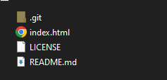

# Kodluyoruz Ilk Repo

bu repo [Kodluyoruz](https://kodluyoruz.org/) Front-End Eğitiminde oluiturduğumuz ilk repo. İçerisinde bir adet README dosyası, bir adet de index.html barındırıyor.

## Installation

Öncelikle projeyi clonlayın.

```bash
git clone  https://github.com/nazimergul/kodluyoruzilkrepo.git
```
## Usage

Projeyi cloneladıktan sonra Visual Studio Code programında açınız.

Linux için:
```linux
cd kodluyoruzilkrepo
code .
```
## Contributing
Pull requestler kabul edilir. Büyük değişiklikler için, lütfen önce neyi değiştirmek istediğinizi tartışmak için bir konu açınız.


## License
[MIT](https://choosealicense.com/licenses/mit/)

